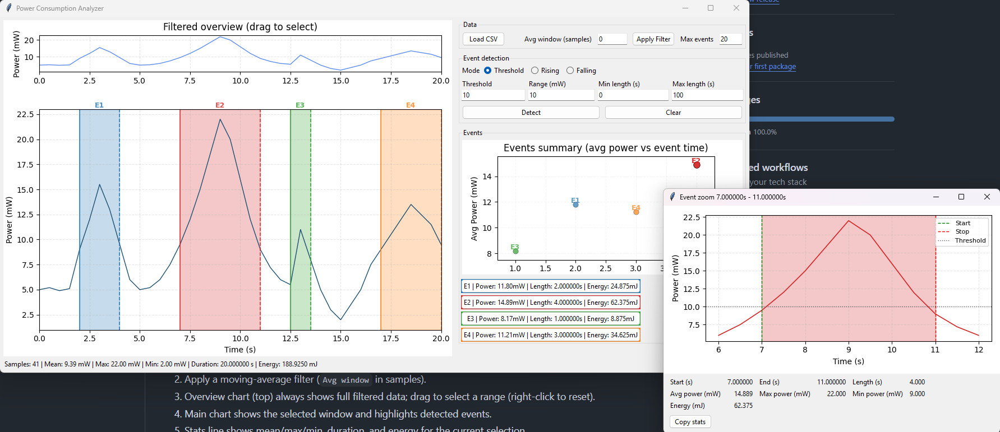

# Power Consumption Analyzer

Desktop Tkinter + Matplotlib tool to explore power traces from CSV, apply a moving-average filter, select time ranges, and detect events with threshold/rising/falling modes. Built for quick inspection with linked overview/main charts, stats, and event summaries. Now includes an integrated log viewer for TeraTerm format logs with time synchronization to the power chart.

## Setup

```bash
python -m pip install --upgrade pip
python -m pip install numpy matplotlib tk
```

## Run

```bash
python power_analysis_app.py
```

The app auto-loads `samplefile.csv` if present. Otherwise, click **Load CSV**.

## Screenshot



## Data flow

1. Load CSV with two columns: `TimeSeconds,Power_mW` (header + data rows).
2. Apply a moving-average filter (`Avg window` in samples).
3. Overview chart (top) always shows full filtered data; drag to select a range (right-click to reset).
4. Main chart shows the selected window and highlights detected events.
5. Stats line shows mean/max/min, duration, and energy for the current selection.

## Detection modes

- **Threshold**: Detects segments where the signal rises above `Threshold` and later falls below it within the min/max length window.
- **Rising**: Starts on upward cross of `Threshold`; event is valid only if it reaches at least `Threshold + Range` within the length window.
- **Falling**: Starts on downward cross of `Threshold`; event is valid when it drops to `Threshold - Range` within the length window (no recovery required).

Use the Data panel `Max events` input to cap detected events per run.

## Event views

- Main chart: event spans, markers, and labels.
- Event summary: scatter of average power vs length (s); buttons below match event colors.
- Event zoom: shaded window with start/end/threshold markers plus a stats table; copy stats to clipboard for Excel.

## Log Viewer

The application includes a log viewer in a separate window for analyzing TeraTerm format log files alongside power data.

### Opening the Log Viewer

Click **Open Log Viewer** in the Data section to open the log viewer window.

### Loading logs

Click **Load Log** in the log viewer window to open a log file. Supported formats:
- TeraTerm logs with timestamps: `[YYYY-MM-DD HH:MM:SS.mmm]` or `[HH:MM:SS.mmm]`
- Plain timestamps at line start
- Numeric second-based timestamps

### Error and keyword highlighting

Log entries are automatically highlighted based on keywords:
- **Red (Error)**: Lines containing `error`, `fail`, `failed`, `failure`, `fatal`, `critical`, `exception`
- **Yellow (Warning)**: Lines containing `warning`, `warn`, `caution`, `alert`

### Custom keyword highlighting

You can define custom keywords to highlight in additional colors:
- **Blue**: Enter comma-separated keywords in the Blue field
- **Green**: Enter comma-separated keywords in the Green field  
- **Magenta**: Enter comma-separated keywords in the Magenta field

Click **Apply** to update the highlighting. Error and warning highlighting takes priority over custom colors.

### Time synchronization

Use the **Time offset (s)** field to synchronize log timestamps with the power chart:
1. Enter an offset value (positive or negative seconds)
2. Click **Apply Offset** to adjust displayed timestamps
3. Log times will be shifted to align with chart times

### Filtering options

- **Show All**: Display all log entries
- **Errors Only**: Show only entries with error keywords
- **Warnings+**: Show entries with warning or error keywords
- **Auto filter by chart selection**: Only show log entries within the current chart time range

### Search

Type a search term and press Enter or click **Search** to filter entries and highlight matches in yellow.

### Chart markers

Click on any log entry with a valid timestamp to add a purple vertical marker on the main chart at that time. The chart view will automatically center on the marker if it's outside the current view.

### Sample log file

A sample TeraTerm log file (`sample_teraterm.log`) is included for testing.

## Detection profiles

Create a `profile.json` next to `power_analysis_app.py` to quickly load presets for mode/thresholds/lengths. The app reads either a top-level array or `{ "profiles": [ ... ] }`.

```json
[
  {
    "name": "Threshold Default",
    "mode": "threshold",
    "threshold1": 10,
    "threshold2": 20,
    "min_len": 0,
    "max_len": 100
  }
]
```

Notes:
- `mode` must be one of `threshold`, `rising`, or `falling`.
- `threshold1` maps to the primary threshold; `threshold2` is the secondary level for rising/falling.
- `min_len` and `max_len` are seconds; set `max_len` to `0` or omit to treat it as “no upper limit”.
- The first profile is auto-applied on launch; pick others from the Profile dropdown next to Mode.

## Authors

Y Nguyen and ChatGPT Codex
